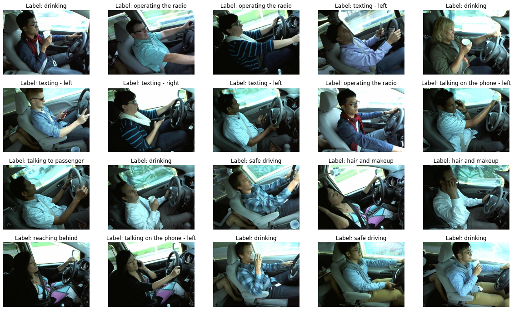
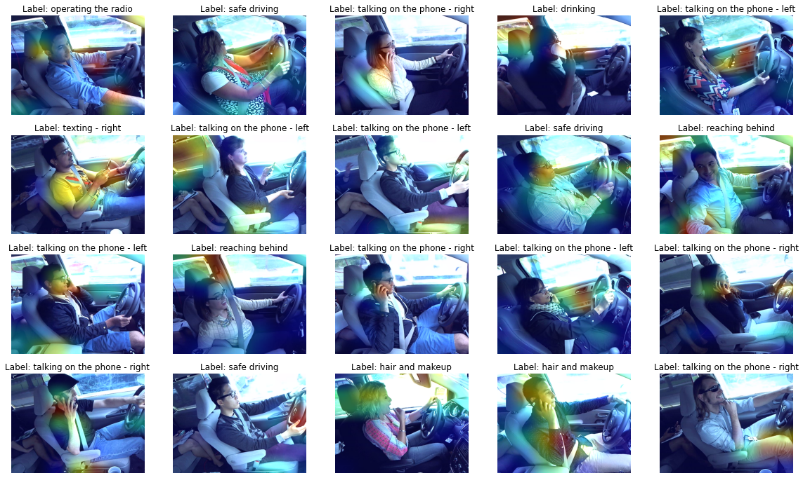

# State Farm Distracted Driver Detection
## Goals
* Experiment with various modern deep learning techniques from the paper, [Bag of Tricks for Image Classification with Convolutional Neural Networks](https://arxiv.org/abs/1812.01187) through the image classification task.
* Build a high-speed and efficient data pipeline using the *TFRecord* file format, *Dataset* API, and the `albumentations` library.
* Explain a model via [Grad-CAM](https://arxiv.org/abs/1610.02391) and host it using *TF Serving* or *SageMaker* to enable real-time inference.
* (Optional) Effectively manage experiments through the `wandb` library.
  
## Requirements
* The dataset can be downloaded from [this Kaggle competition](https://www.kaggle.com/c/state-farm-distracted-driver-detection).
* In addition to the [Anaconda](https://www.anaconda.com) libraries, you need to install `tensorflow`, `tensorflow-addons`, `tensorflow-hub`, `albumentations` and `wandb`.

## Experimental Setup
* [EfficientNet-B0](https://arxiv.org/abs/1905.11946) was used as the base model. On top of that, fully connected layers and dropout layers were added.
* The batch size was set to 32, the number of epochs was set to 500, and an early stopping option was applied.
* [A cosine decay schedule with restarts](https://arxiv.org/pdf/1608.03983.pdf) was used. In this case, the initial learning rate was set to 0.001 and the first decay step was set to 1,000.
* The images were resized to 224 x 224 and image data augmentation through rotation, scaling, and shifting was applied. Below are examples of data augmentation.

## Experiment Result
* The evaluation criterion for this Kaggle competition is multi-class logarithmic loss.
* As the validation set, 25% of the images were randomly assigned. However, in the case of the 5-fold CV ensemble, the dataset was divided into 5 equal parts.

|                                                                                                        Treatment                                                                                                        | Public Score | Private Score |
|:-----------------------------------------------------------------------------------------------------------------------------------------------------------------------------------------------------------------------:|:------------:|:-------------:|
|                                                                                        [RAdam](https://arxiv.org/abs/1908.03265)                                                                                        |    1.0260    |    0.6792     |
|                                                                                        [AdamW](https://arxiv.org/abs/1711.05101)                                                                                        |    0.9117    |    0.7140     |
|                                                                                     RAdam + [SWA](https://arxiv.org/abs/1803.05407)                                                                                     |    1.1547    |    0.7527     |
|                                                                                    RAdam + [Mixup](https://arxiv.org/abs/1710.09412)                                                                                    |    0.8331    |    0.6423     |
|                                                                            RAdam + [Label Smoothing](https://arxiv.org/abs/1906.02629) (0.1)                                                                            |    0.9047    |    0.7891     |
|                                                                                              RAdam + Mixup + TTA (3 times)                                                                                              |    0.7434    |    0.5777     |
|                                                                                        RAdam + Mixup + TTA + 5-fold CV Ensemble                                                                                         |              |               |
| [Pseudo Labeling](https://www.researchgate.net/publication/280581078_Pseudo-Label_The_Simple_and_Efficient_Semi-Supervised_Learning_Method_for_Deep_Neural_Networks) (> 0.9) + RAdam + Mixup + TTA + 5-fold CV Ensemble |              |               |

### Model Explainability with Grad-CAM
* 20 samples were randomly selected from the test set and visualized using the Grad-CAM technique. Labels shown are predicted.

## Model Serving
### TF Serving
* You need to download and run the docker image via `scripts/run.sh` file. Then, you can test model inference through a locally hosted TF Serving.
### SageMaker 
* T.B.C.